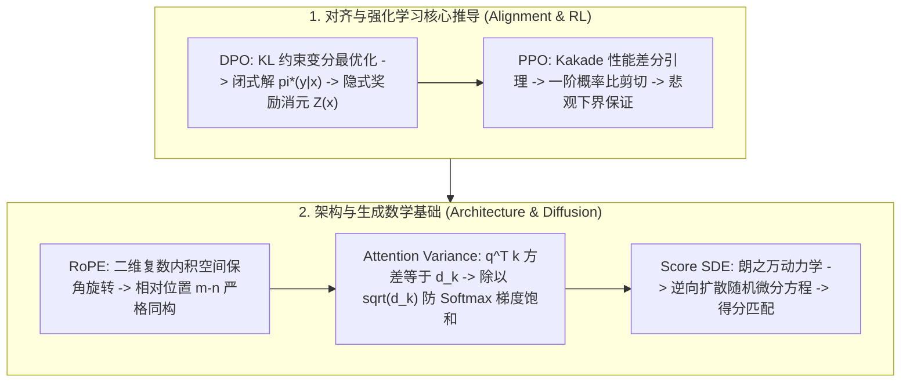

# 🌐 RS 数学推导与白板面经：PPO 剪切损失、DPO 闭式解与 RoPE 旋转矩阵

> **核心摘要**：在算法研究科学家（RS）的白板推导面试（Whiteboard Math Round）中，面试官要求候选人脱离 PPT 和现成工具包，在黑板上从第一性原理推演核心算法的闭式解、最优化边界与概率性质。本指南系统汇编顶会级数学推导：DPO 闭式解与隐式奖励消元、PPO 剪切悲观下界、RoPE 复数内积同构、Attention 缩放因子方差控制以及 Score SDE 扩散逆向方程。

---

## 💡 交互式 Mermaid 架构流程图



---

## 第一章：DPO (Direct Preference Optimization) 极值解数学证明

### 1.1 从带 KL 约束的 RLHF 目标函数推导闭式最优解

在标准 RLHF 中，策略优化目标为：
$$\max_{\pi} \mathbb{E}_{x \sim \mathcal{D}, y \sim \pi(y|x)} [r(x, y)] - \beta \mathbb{D}_{\text{KL}}(\pi(y|x) \parallel \pi_{\text{ref}}(y|x))$$

对于任意给定输入 $x$，将其展开为对所有可能生成 $y$ 的期望求和：
$$\max_{\pi} \sum_y \pi(y|x) r(x, y) - \beta \sum_y \pi(y|x) \log \frac{\pi(y|x)}{\pi_{\text{ref}}(y|x)} = \max_{\pi} \sum_y \pi(y|x) \left( r(x, y) - \beta \log \frac{\pi(y|x)}{\pi_{\text{ref}}(y|x)} \right)$$

提取负常数项 $-\beta$，构造对数内部结构：
$$= \max_{\pi} -\beta \sum_y \pi(y|x) \log \left( \frac{\pi(y|x)}{\pi_{\text{ref}}(y|x) \exp\left( \frac{1}{\beta} r(x, y) \right)} \right)$$

定义归一化配分函数（Partition Function）：
$$Z(x) = \sum_y \pi_{\text{ref}}(y|x) \exp\left( \frac{1}{\beta} r(x, y) \right)$$

将分子分母同时乘除 $Z(x)$，改写为相对吉布斯分布的形式：
$$= \max_{\pi} -\beta \sum_y \pi(y|x) \log \left( \frac{\pi(y|x)}{\frac{1}{Z(x)} \pi_{\text{ref}}(y|x) \exp\left( \frac{1}{\beta} r(x, y) \right)} \right) + \beta \log Z(x) \sum_y \pi(y|x)$$
$$= \max_{\pi} -\beta \mathbb{D}_{\text{KL}} \left( \pi(y|x) \,\Big\|\, \frac{1}{Z(x)} \pi_{\text{ref}}(y|x) \exp\left( \frac{1}{\beta} r(x, y) \right) \right) + \beta \log Z(x)$$

由于 KL 散度非负（$\mathbb{D}_{\text{KL}} \ge 0$），当且仅当两分布完全相同时取全局最小值 0。因此，**唯一的最优策略闭式解**为：
$$\pi^*(y|x) = \frac{1}{Z(x)} \pi_{\text{ref}}(y|x) \exp\left( \frac{1}{\beta} r(x, y) \right)$$

### 1.2 隐式奖励重参数化与 Reward Model 消元

对最优策略两边取自然对数：
$$\log \pi^*(y|x) = \log \pi_{\text{ref}}(y|x) + \frac{1}{\beta} r(x, y) - \log Z(x)$$

反解出真实奖励函数 $r(x, y)$：
$$r(x, y) = \beta \log \frac{\pi^*(y|x)}{\pi_{\text{ref}}(y|x)} + \beta \log Z(x)$$

将隐式奖励函数代入 Bradley-Terry 偏好概率模型：
$$P(y_w \succ y_l \mid x) = \sigma(r(x, y_w) - r(x, y_l)) = \frac{1}{1 + \exp\left( -(r(x, y_w) - r(x, y_l)) \right)}$$

计算奖励差分项：
$$r(x, y_w) - r(x, y_l) = \left( \beta \log \frac{\pi^*(y_w|x)}{\pi_{\text{ref}}(y_w|x)} + \beta \log Z(x) \right) - \left( \beta \log \frac{\pi^*(y_l|x)}{\pi_{\text{ref}}(y_l|x)} + \beta \log Z(x) \right)$$
$$= \beta \log \frac{\pi^*(y_w|x)}{\pi_{\text{ref}}(y_w|x)} - \beta \log \frac{\pi^*(y_l|x)}{\pi_{\text{ref}}(y_l|x)}$$

**归一化常数 $\beta \log Z(x)$ 在两项做差时被精确消去！**
因此，完全无需显式估计复杂的奖励模型，直接以负对数似然构建 **DPO 损失函数**：
$$\mathcal{L}_{\text{DPO}}(\theta) = -\mathbb{E}_{(x, y_w, y_l) \sim \mathcal{D}} \left[ \log \sigma \left( \beta \log \frac{\pi_\theta(y_w \mid x)}{\pi_{\text{ref}}(y_w \mid x)} - \beta \log \frac{\pi_\theta(y_l \mid x)}{\pi_{\text{ref}}(y_l \mid x)} \right) \right]$$

---

## 第二章：PPO 剪切目标函数的悲观下界证明

根据 Kakade & Langford 提出的性能差分引理（Performance Difference Lemma），新策略 $\pi_\theta$ 与旧策略 $\pi_{\text{old}}$ 的累积期望回报之差为：
$$\eta(\pi_\theta) - \eta(\pi_{\text{old}}) = \mathbb{E}_{s \sim \rho_{\pi_\theta}, a \sim \pi_\theta} [A^{\pi_{\text{old}}}(s, a)]$$

由于无法直接从未知新策略 $\rho_{\pi_\theta}$ 采样状态分布，TRPO 与 PPO 引入重要性采样构造代理目标函数（Surrogate Objective）：
$$L_{\pi_{\text{old}}}(\pi_\theta) = \mathbb{E}_{s \sim \rho_{\pi_{\text{old}}}, a \sim \pi_{\text{old}}} \left[ \frac{\pi_\theta(a|s)}{\pi_{\text{old}}(a|s)} A^{\pi_{\text{old}}}(s, a) \right] = \mathbb{E}_t [r_t(\theta) \hat{A}_t]$$
其中 $r_t(\theta) = \frac{\pi_\theta(a_t|s_t)}{\pi_{\text{old}}(a_t|s_t)}$ 为概率比率。

为了防止策略更新迈步过大导致性能雪崩，PPO 定义**剪切代理目标**：
$$L^{\text{CLIP}}(\theta) = \mathbb{E}_t \left[ \min\left( r_t(\theta) \hat{A}_t, \, \text{clip}(r_t(\theta), 1-\epsilon, 1+\epsilon) \hat{A}_t \right) \right]$$

### 悲观下界性质分析 (Pessimistic Bound)

1. **当优势 $\hat{A}_t > 0$（好动作）时**：
   - 若 $r_t(\theta) > 1+\epsilon$（新策略大幅提高了该好动作概率），$\text{clip}$ 项截断为 $(1+\epsilon)\hat{A}_t$。
   - $\min(r_t \hat{A}_t, (1+\epsilon)\hat{A}_t) = (1+\epsilon)\hat{A}_t$。梯度归零，**防止过度贪婪更新**。
2. **当优势 $\hat{A}_t < 0$（坏动作）时**：
   - 若 $r_t(\theta) > 1+\epsilon$（新策略错误地放大了坏动作概率），$\text{clip}$ 项为 $(1+\epsilon)\hat{A}_t$（绝对值更小，负得更少）。
   - 取 $\min(r_t \hat{A}_t, (1+\epsilon)\hat{A}_t) = r_t \hat{A}_t$（保留更大的负惩罚），强力施加负梯度把概率拉回！

通过 $\min$ 操作，PPO 构建了真实代理性能的**悲观下界（Pessimistic Lower Bound）**，确保了在不计算二阶逆 Hessian 矩阵的前提下实现一阶单调稳定策略更新。

---

## 第三章：RoPE 旋转位置编码的复数内积同构证明

RoPE 的核心设计哲学：**寻找一个映射，使得两个词向量变换后的点积只包含其相对位置差 $m-n$**。

设输入向量在二维子空间中表示为复数 $q, k \in \mathbb{C}$。设位置编码变换函数为 $f(q, m)$ 与 $f(k, n)$。要求满足保内积条件：
$$\langle f(q, m), f(k, n) \rangle = g(q, k, m-n)$$

在复数空间中，内积定义为 $\langle u, v \rangle = \text{Re}(u v^*)$。利用极坐标重参数化：
$$q = \|q\| e^{i\theta_q}, \quad k = \|k\| e^{i\theta_k}, \quad f(q, m) = \|q\| e^{i(\theta_q + \phi(m))}$$

代入复数共轭相乘：
$$f(q, m) f(k, n)^* = \|q\| \|k\| e^{i(\theta_q - \theta_k + \phi(m) - \phi(n))}$$

要使结果与绝对位置无关、严格仅依赖 $m-n$，必然要求相位函数满足线性同态：
$$\phi(m) - \phi(n) = \phi(m - n) \implies \phi(m) = m \theta$$

写回实数二维矩阵形式，即为**二维旋转矩阵算子**：
$$R_m = \begin{bmatrix} \cos(m\theta) & -\sin(m\theta) \\ \sin(m\theta) & \cos(m\theta) \end{bmatrix}$$

对于高维向量 $d$，将其切分为 $d/2$ 个二维正交子空间，每个子空间赋予不同的基频 $\theta_i = 10000^{-2(i-1)/d}$：
$$R_{\Theta, m}^d = \text{diag}\left( R_{m\theta_1}, R_{m\theta_2}, \dots, R_{m\theta_{d/2}} \right)$$

**核心性质**：$R_m$ 为正交矩阵（$R_m^T R_m = I$），旋转变换严格保持向量的欧几里得模长不变：$\|R_m q\|_2 = \|q\|_2$，绝不破坏多头注意力的归一化尺度！

```python
import numpy as np

def pure_python_rope_rotation(x: np.ndarray, m: int, theta: float = 10000.0) -> np.ndarray:
    d = len(x)
    freqs = 1.0 / (theta ** (np.arange(0, d, 2) / d))
    angles = m * freqs
    cos_a, sin_a = np.cos(angles), np.sin(angles)
    
    x_rotated = np.zeros_like(x)
    for i in range(d // 2):
        x_rotated[2*i] = x[2*i] * cos_a[i] - x[2*i+1] * sin_a[i]
        x_rotated[2*i+1] = x[2*i] * sin_a[i] + x[2*i+1] * cos_a[i]
    return x_rotated

if __name__ == "__main__":
    vec = np.array([1.0, 2.0, 3.0, 4.0])
    print("✅ RoPE 旋转向量 (m=1):", pure_python_rope_rotation(vec, m=1))
```

---

## 第四章：自注意力机制中 $\frac{1}{\sqrt{d_k}}$ 缩放因子的方差严格推导

在 Transformer 自注意力层中，计算公式为 $\text{Attention}(Q, K, V) = \text{softmax}\left( \frac{QK^T}{\sqrt{d_k}} \right) V$。

### 为什么必须除以 $\sqrt{d_k}$？
假设查询向量 $q \in \mathbb{R}^{d_k}$ 与键向量 $k \in \mathbb{R}^{d_k}$ 的各分量 $q_i, k_i$ 为独立同分布的随机变量，满足：
$$\mathbb{E}[q_i] = \mathbb{E}[k_i] = 0, \quad \text{Var}(q_i) = \text{Var}(k_i) = 1$$

计算两向量点积 $S = q^T k = \sum_{i=1}^{d_k} q_i k_i$ 的期望与方差：
1. 期望：
   $$\mathbb{E}[S] = \sum_{i=1}^{d_k} \mathbb{E}[q_i k_i] = \sum_{i=1}^{d_k} \mathbb{E}[q_i]\mathbb{E}[k_i] = 0$$
2. 方差：
   $$\text{Var}(S) = \sum_{i=1}^{d_k} \text{Var}(q_i k_i) = \sum_{i=1}^{d_k} \left( \mathbb{E}[q_i^2 k_i^2] - (\mathbb{E}[q_i k_i])^2 \right) = \sum_{i=1}^{d_k} \mathbb{E}[q_i^2] \mathbb{E}[k_i^2] = \sum_{i=1}^{d_k} 1 \cdot 1 = d_k$$

**点积的方差随着特征维度 $d_k$ 呈线性增长**！当 $d_k = 128$ 时，标准差 $\sigma = \sqrt{128} \approx 11.3$。
若不进行缩放，$QK^T$ 的数值极大，导致 Softmax 函数被推入两端极端饱和区（$\text{softmax}(z) \approx 0$ 或 $1$），其导数 $\frac{\partial \text{softmax}}{\partial z} = \text{softmax}(1-\text{softmax}) \approx 0$，**造成极其严重的梯度消失（Vanishing Gradients）**！

通过除以 $\sqrt{d_k}$ 进行归一化：
$$\text{Var}\left( \frac{S}{\sqrt{d_k}} \right) = \frac{\text{Var}(S)}{d_k} = \frac{d_k}{d_k} = 1$$
使点积方差恒定为 1，确保 Softmax 处于梯度灵敏的工作区间。
