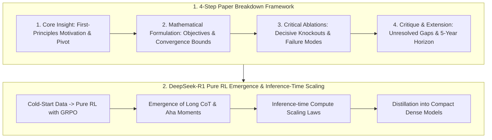

# 🌐 RS Paper Deep Dive Framework: Articulating Novelty & Research Vision

> **Executive Summary**: In Research Scientist (RS) interviews, interviewers evaluate a candidate's **independent research taste, long-term technical vision, and rigorous deconstruction of SOTA literature**. Candidates must look beyond abstract summaries to demonstrate first-principles critical reasoning, distinguish scalable breakthroughs from empirical tweaks, and grasp theoretical asymptotic bounds. This guide presents the 4-step paper breakdown framework, DeepSeek-R1 pure RL emergence, and pure Python Pass@k estimators.

---

## 💡 Interactive Mermaid Architecture



---

## Chapter 1: Articulating Your Research Vision (3-5 Year Horizon)

In Senior/Staff RS interviews, the central question is: **"Where is the major algorithmic breakthrough in the next 3-5 years, and what is the core theoretical bottleneck?"**

### Structured Formulation (Problem $\to$ Bottleneck $\to$ Scalable Breakthrough)
1. **High-Impact Problem**: Choose a fundamental challenge with multi-year longevity (e.g., test-time compute scaling, continuous diffusion generation, embodied world models, pure RL alignment).
2. **Fundamental Bottleneck**: Pinpoint the theoretical failure mode (e.g., autoregressive linear generation limits, hallucination ceilings of human SFT, reward hacking under sparse signals).
3. **Scalable Algorithmic Path**: Propose mechanisms that **monotonically improve with scale (Scaling Law Friendly)** rather than handcrafted heuristics.

---

## Chapter 2: The 4-Step Paper Breakdown Framework

### Step 1: Core Motivation & Eureka Insight
Never just state benchmark score deltas. Articulate: *"Prior paradigms were fundamentally constrained by X; the authors' pivotal realization was that underlying mathematical structure Y is isomorphic to Z, thereby eliminating constraint X."*

### Step 2: Mathematical Formulation & Mechanism
Write down the exact loss objectives (e.g., DPO implicit reward substitution, GRPO group-normalized advantage, Flow Matching vector field ODEs). Explain gradient pathways and convergence guarantees.

### Step 3: Critical Ablations & Failure Modes
Identify the single decisive ablation experiment that validates the core claim. Dissect where the method breaks down under out-of-distribution shifts.

### Step 4: Critical Critique & Personal Extension
Highlight unresolved limitations (compute bottlenecks, hyperparameter sensitivity) and propose your immediate follow-up hypothesis.

---

## Chapter 3: Fundamental Breakthroughs vs. Engineering Tweaks

| Dimension | Fundamental Algorithmic Breakthrough | Engineering Tweaks / Tricks |
|---|---|---|
| **Mathematical Nature** | Reformulates the optimization objective or geometric manifold (Transformer, DDPM, DPO, GRPO) | Hyperparameter sweeps, optimizer schedulers, heuristic feature engineering |
| **Scalability** | **Scales monotonically** with compute and model parameters | Effective at 7B scale; exhibits diminishing returns at 70B+ scale |
| **Generality** | Universal across modalities (NLP, Vision, Multimodal, Audio) | Overfitted to a narrow benchmark or leaderboard |

---

## Chapter 4: DeepSeek-R1 Pure RL & Inference-Time Scaling

DeepSeek-R1 proved that **pure reinforcement learning (RL) without massive supervised fine-tuning (SFT) can induce self-reflection, backtracking, and long chain-of-thought (CoT) reasoning**.

### GRPO (Group Relative Policy Optimization)
Unlike traditional PPO which requires an equally large Critic network to estimate $V(s)$, **GRPO** samples a group of outputs $\{o_1, \dots, o_G\}$ per prompt and standardizes rewards:
$$A_i = \frac{r_i - \text{mean}(\{r_1, \dots, r_G\})}{\text{std}(\{r_1, \dots, r_G\})}$$
This eliminates Critic VRAM overhead entirely, saving $>50\%$ memory and enabling long-context rollouts.

### Inference-Time Compute Scaling
Scaling test-time compute (generating longer thinking trajectories) enables Pass@k to scale as a power law with search tokens, establishing a new scaling dimension alongside pre-training compute.

---

## Chapter 5: Pure Python Pass@k & Majority Voting Estimators

$$\text{Pass}@k = \mathbb{E} \left[ 1 - \frac{\binom{n-c}{k}}{\binom{n}{k}} \right]$$

```python
import math

def pure_python_pass_at_k(n: int, c: int, k: int) -> float:
    if n - c < k:
        return 1.0
    return 1.0 - (math.comb(n - c, k) / math.comb(n, k))

def pure_python_majority_vote(answers: list[str]) -> str:
    counts: dict[str, int] = {}
    for ans in answers:
        counts[ans] = counts.get(ans, 0) + 1
    return max(counts, key=counts.get)

if __name__ == "__main__":
    print("✅ Pass@1 (n=100, c=25):", round(pure_python_pass_at_k(100, 25, 1), 4))
    print("✅ Pass@5 (n=100, c=25):", round(pure_python_pass_at_k(100, 25, 5), 4))
    print("✅ Pass@10 (n=100, c=25):", round(pure_python_pass_at_k(100, 25, 10), 4))
    print("✅ Majority Winner:", pure_python_majority_vote(["42", "42", "40", "42"]))
```

---

## Chapter 6: The Peer Reviewer Mindset

Evaluate SOTA papers across four pillars: **Soundness** (implicit distributional assumptions), **Novelty** (dual isomorphisms in prior physics/statistics), **Significance** ($>3\sigma$ effect size over tuned baselines), and **Reproducibility** (multi-seed variance disclosures).
