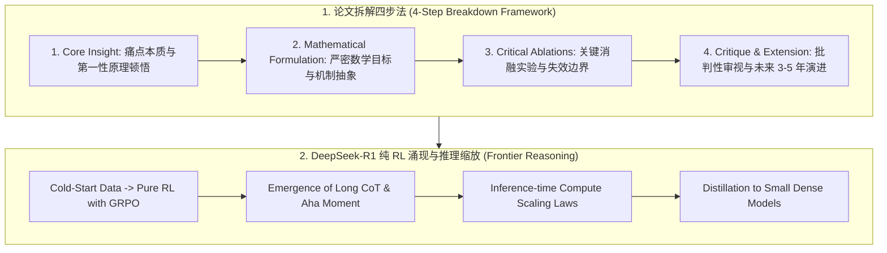
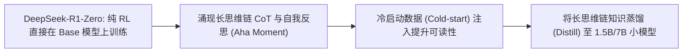

# 🌐 RS 论文拆解与研究 Vision：如何向面试官复述 SOTA 论文创新点

> **核心摘要**：在算法研究科学家（Research Scientist, RS）面试中，面试官最看重的是候选人的**独立科研品味（Research Taste）、前沿技术视野（Research Vision）以及对 SOTA 论文的批判性深度解构能力**。面试绝不是简单复述论文摘要，而是展现“从第一性原理审视问题、刺破工程增量迷雾、洞悉算法理论边界”的高维认知。本指南深入剖析论文拆解四步法、DeepSeek-R1 纯 RL 涌现机制与 Pass@k 评估算子。

---

## 💡 交互式 Mermaid 架构流程图



---

## 第一章：如何向面试官阐述 Research Vision

在 RS 面试的 Senior/Staff 级别，面试官最关心的是 **Research Vision（研究视野）**：你认为大模型未来 3-5 年最重要的技术突破口在哪里？针对你选定的方向，目前最核心的 Theoretical/Engineering Bottleneck 是什么？

### 1. 结构化阐述框架 (Problem $\to$ Bottleneck $\to$ Scalable Breakthrough)

1. **宏观命题选择 (High-impact Problem)**：选择具备 3-5 年长线生命力的基础科学问题（如：推理时算力缩放、多模态具身世界模型、非自回归/连续扩散生成、纯 RL 符号对齐）。
2. **理论/工程瓶颈定位 (Fundamental Bottleneck)**：精准指出当前范式卡在哪里（如：自回归解码的线性串行吞吐上限、基于人工标注的监督微调（SFT）幻觉天花板、强化学习稀疏奖励探索效率低下）。
3. **可规模化突破路径 (Scalable Algorithmic Path)**：提出能够**随算力增长单调受益（Scaling Law 友好）**的算法机制，拒绝依赖人工规则修补。

> 💡 **直观理解**: Research Vision 不是口号,而是"问题 → 理论极限 → 可扩展突破"的推理链:先选高影响力长线问题(推理、世界模型),再指出当前卡在哪(记忆上界、样本复杂度、奖励稀疏),最后给出能随算力放大的算法路线。面试官顺着这条链追问——答得上就是真 vision,答不上就是背稿。
>
> 🎤 **面试速答**: "结论:我 3-5 年的研究 vision 聚焦推理——用纯 RL 让模型学会长思维链,当前瓶颈是样本效率与奖励稀疏。原理:好的 vision 必须同时讲清问题重要性、当前理论/工程瓶颈、以及可规模化的路线,三者缺一就露怯。举个例子:DeepSeek-R1 展示了纯 RL 可涌现自我纠错与长 CoT,我会立刻追问 GRPO 的组内相对奖励够不够 dense、冷启动 SFT 数据占比如何缩放、蒸馏到小模型后推理能力是否缩水——把 vision 落到可证伪的问题上。"

---

## 第二章：SOTA 论文拆解四步法 (The 4-Step Breakdown)

在 Paper Deep Dive 环节，按照以下标准四步法展开复述，能瞬间建立资深研究员的专业形象：

### Step 1: 核心痛点与顿悟 (Core Motivation & Insight)
* **不要说**：“这篇论文提出了一个新的模型架构，在 GSM8K 上提升了 3 个点。”
* **必须说**：“在过去范式中，模型严重受制于 [核心痛点 X]；原作者的关键顿悟在于**跳出了传统做法，发现 [底层数学特性 Y] 实际上等价于 [物理机制 Z]**，从而以极其优雅的方式消解了 [痛点 X]。”

### Step 2: 数学形式化与算法机制 (Mathematical Formulation)
* 准确板书核心目标函数（如 DPO 的隐式奖励推导、GRPO 的组内优势归一化、Flow Matching 的速度场插值 ODE）。
* 解释每个变量与超参数的物理意义、梯度传播路径以及收敛性保证。

### Step 3: 关键消融实验与失效边界 (Critical Ablations & Failure Modes)
* 指出论文中最决定性的消融实验（Ablation）：如果去掉模块 A，性能是平缓下降还是彻底崩盘？
* 深入分析该算法在哪些**极端或分布偏移场景下会失效（Failure Modes）**。

### Step 4: 批判性延伸与我的思考 (Critical Critique & My Extension)
* 阐述原论文未解决的开放性缺陷（如：计算复杂度过高、对超参敏感、评估基准存在过拟合风险）。
* 给出你如果作为后续研究者，第一步会尝试做出的算法改进方案。

---

## 第三章：区分“算法根本突破”与“工程 Trick 增量”

| 维度 | 算法根本突破 (Fundamental Breakthrough) | 工程 Trick 增量 (Engineering Tweaks) |
|---|---|---|
| **数学本质** | 重构优化目标、改变信息论或几何结构（如 Transformer、DDPM、DPO、GRPO） | 调参、组合已有模块、调整学习率调度（如 Warmup+Cosine 调整） |
| **可扩展性** | **满足 Scaling Law**：随着模型参数与训练算力增加，优势单调放大 | 在特定尺度（如 7B）有效，但在 70B+ 尺度上收益衰减或失效 |
| **通用性** | 跨模态、跨任务通用（语言、视觉、多模态均可无缝适配） | 仅在单一特定 Benchmark（如某个特定排行榜）过拟合提分 |
| **代码洁癖度** | 核心机制极其简洁优雅（数十行核心逻辑） | 包含数十个 if-else 启发式规则与超参数微调魔改 |

---

## 第四章：DeepSeek-R1 纯 RL 涌现机制与推理缩放深度剖析

DeepSeek-R1 是近年来最具代表性的前沿研究范例。其核心突破在于**证明了不依赖海量人类标注 SFT 数据，仅通过纯强化学习（Pure RL）在大规模探索中自发涌现高级推理能力**。



### 1. GRPO 算法原理与优势
传统 PPO 依赖一个与 Actor 同等规模的 Critic 网络估计价值函数 $V(s)$，消耗翻倍显存。**GRPO (Group Relative Policy Optimization)** 对每个 Prompt 采样一组输出 $\{o_1, o_2, \dots, o_G\}$，计算组内相对优势：
$$A_i = \frac{r_i - \text{mean}(\{r_1, \dots, r_G\})}{\text{std}(\{r_1, \dots, r_G\})}$$
彻底去除了 Critic 模型，将强化学习训练显存压降 50% 以上，支持极大长文本上下文生成。

### 2. 推理期算力缩放定律 (Inference-time Compute Scaling)
* 过去关注训练算力（Pre-training Compute）：$L(N, D)$。
* R1 与 o1 证明了**测试期算力缩放（Inference-time Compute）**：通过生成更长的思维链（Tokens 数量扩大），在测试阶段投入更多算力，Pass@k 与准确率呈现幂律单调上升！

---

## 第五章：Pure Python 论文评估算子集合 (Pass@k & Majority Voting)

Pass@k 衡量"生成 $n$ 个样本中至少有一个正确答案"的无偏估计。组合数公式为：
$$\text{Pass}@k = \mathbb{E} \left[ 1 - \frac{\binom{n-c}{k}}{\binom{n}{k}} \right]$$
其中 $n$ 为采样总数，$c$ 为正确答案样本数。

```python
import math
import numpy as np

def pure_python_pass_at_k(n: int, c: int, k: int) -> float:
    """
    计算 Pass@k 的无偏估计值
    """
    if n - c < k:
        return 1.0
    return 1.0 - (math.comb(n - c, k) / math.comb(n, k))

def pure_python_majority_vote(answers: list[str]) -> str:
    """
    Self-Consistency 多数投票算子 (Majority Voting @ N)
    """
    counts: dict[str, int] = {}
    for ans in answers:
        counts[ans] = counts.get(ans, 0) + 1
    return max(counts, key=counts.get)

if __name__ == "__main__":
    # 模拟：采样 100 次，其中 25 次正确
    pass_1 = pure_python_pass_at_k(100, 25, 1)
    pass_5 = pure_python_pass_at_k(100, 25, 5)
    pass_10 = pure_python_pass_at_k(100, 25, 10)
    
    print("✅ Pass@1:", round(pass_1, 4))   # 0.2500
    print("✅ Pass@5:", round(pass_5, 4))   # 0.7627
    print("✅ Pass@10:", round(pass_10, 4)) # 0.9437
    
    votes = ["42", "42", "40", "42", "41", "42"]
    print("✅ 多数投票胜出答案:", pure_python_majority_vote(votes))
```

---

## 第六章：审稿人 (Peer Reviewer) 视角：如何挑剔一篇 SOTA 论文

当面试官要求你对一篇论文进行批判性评审时，应从以下四大黄金维度切入：

1. **自洽性 (Soundness)**：数学推导是否存在隐式边界条件假设（如假设数据服从高斯分布、梯度Lipschitz连续）？实验对照组 Baseline 是否充分调优？
2. **新颖性 (Novelty)**：核心数学机制是否早在统计学或物理学领域已有对偶形态？是原理创新还是仅仅换了新名字？
3. **显著性与复现性 (Significance & Reproducibility)**：收益是否大于 $3\sigma$ 置信区间？多种子（Multi-seed）方差是否披露？是否开源了完整的数据清洗脚本与超参数网格？
