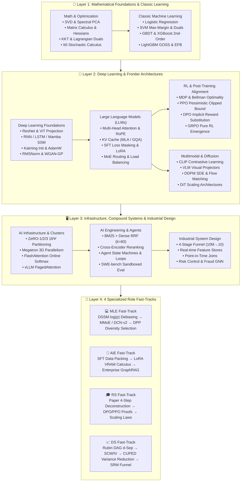
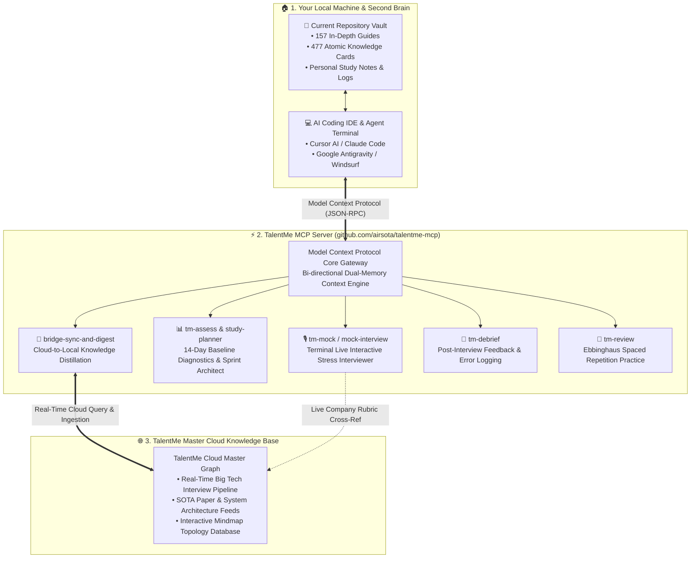

<div align="center">

# 🌟 TalentMe: Awesome AI / ML / LLM Technical Vault & Interview Mastery

**The Ultimate Bilingual (English / 中文) Open-Source Technical Knowledge Base, Mathematical Derivation Codex, and Role-Driven Interview Preparation Architecture.**

[](https://github.com/airsota/TalentMe-Awesome-AI-ML-Interview-Vault)
[](LICENSE)
[](README.md)
[](https://talentme.airsota.com/resources/tech)
[](https://talentme.airsota.com/resources/tech/roadmap)

<br/>

<p align="center">
  <a href="https://talentme.airsota.com/resources/tech"><b>🌐 Live Interactive Vault</b></a> •
  <a href="https://talentme.airsota.com/resources/tech/roadmap"><b>🧭 Interactive Mindmaps</b></a> •
  <a href="#-4-specialized-role-fast-tracks"><b>🎯 4 Role Tracks</b></a> •
  <a href="#-13-foundational-modules-overview"><b>📖 13 Modules</b></a> •
  <a href="#-pure-python-industrial-operator-showcase"><b>🛠️ Python Operators</b></a>
</p>

</div>

---

## 🚀 Overview & Philosophy

**TalentMe Awesome AI/ML Interview Vault** is engineered to bridge the canyon between academic mathematical theory and 10,000-GPU industrial deployment. 

Unlike generic interview prep lists with superficial answers, this repository provides:
1. **Exhaustive Deep Dives**: 70+ bilingual in-depth guides with rigorous algebra, closed-form derivations, and zero hand-waving.
2. **477 Atomic Knowledge Cards**: Core exam points, failure modes, and interviewer follow-up questions.
3. **Pure Python Implementations**: Standalone, zero-heavy-dependency Python / NumPy operators with unit test cases.
4. **Dual Perspective**: Learn bottom-up via **Foundational Domains** or top-down via **Target Role Tracks** (`MLE`, `AIE`, `RS`, `DS`).

---

## 🎯 4 Specialized Role Fast-Tracks

| Role Track | Focus Areas | Key Mathematical Derivations & System Design | Direct Access |
|---|---|---|:---:|
| 💻 **MLE**<br/>*(Machine Learning Engineer)* | Recommendation funnels, Search/Ads, Feature Stores, Live-coding | • DSSM Two-Tower with $\log(p_j)$ In-batch debiasing<br/>• MMoE Multi-gate Mixture-of-Experts<br/>• ESMM Entire Space Multi-Task Modeling (eliminating SSB)<br/>• DPP (Determinantal Point Processes) diversity greedy search | [📂 MLE Guides](Interviews/MLE/) |
| 🚀 **AIE**<br/>*(AI Systems Engineer)* | Production RAG, Agent systems, Fine-tuning, vLLM serving | • SFT Data Packing algorithms & Loss Masking (`labels=-100`)<br/>• LoRA $B=0$ initialization & QLoRA NF4 VRAM Calculus<br/>• BM25 + Dense RRF ($k=60$) reciprocal rank fusion<br/>• Speculative Decoding memory-bound acceptance sampling | [📂 AIE Guides](Interviews/AIE/) |
| 🎓 **RS**<br/>*(Research Scientist)* | SOTA Paper deconstruction, Alignment math, Scaling laws | • DPO implicit reward substitution & $Z(x)$ cancellation<br/>• PPO pessimistic clipped lower-bound proof<br/>• RoPE complex inner product relative displacement isomorphism<br/>• DeepSeek-R1 pure RL emergence & inference scaling laws | [📂 RS Guides](Interviews/RS/) |
| 📈 **DS**<br/>*(Data Scientist)* | Causal inference, Advanced A/B testing, Uplift modeling | • Rubin Potential Outcomes & Pearl Causal DAG $d$-separation<br/>• SCM (Synthetic Control) convex weights & placebo permutation<br/>• CUPED algebraic variance reduction proof<br/>• SRM Chi-square $\chi^2$ goodness-of-fit diagnostic funnel | [📂 DS Guides](Interviews/DS/) |

---

## 📖 13 Full-Spectrum Foundational Modules & System Topology



### 1. [📐 Math & Optimization (Foundations/Math)](Foundations/Math/)
* **`math-linear-algebra-and-matrix-calculus`** (`.zh.md` / `.en.md`): SVD, PCA spectral decomposition, Jacobians, Hessians, and matrix calculus layout conventions.
* **`math-probability-and-information-theory`** (`.zh.md` / `.en.md`): MLE, MAP, KL divergence, Cross-Entropy, and Monte Carlo Markov Chains (MCMC).
* **`math-convex-optimization-and-calculus`** (`.zh.md` / `.en.md`): KKT conditions, Lagrangian duals, SGD convergence rates, and stochastic calculus (Itô's Lemma).

### 2. [📊 Classic Machine Learning (Foundations/ML)](Foundations/ML/)
* **`classic-ml-cheatsheet`** (`.zh.md` / `.en.md`): Linear/Logistic regression, SVM max-margin derivations, Kernel trick, Bias-Variance tradeoff.
* **`tree-models-and-ensemble-learning`** (`.zh.md` / `.en.md`): Random Forest, GBDT, XGBoost Taylor second-order expansion, LightGBM GOSS & EFB.
* **`clustering-and-dim-reduction`** (`.zh.md` / `.en.md`): K-Means++, GMM EM derivation, t-SNE perplexity, UMAP fuzzy simplicial sets.

### 3. [🧠 Deep Learning Foundations (Foundations/DL)](Foundations/DL/)
* **`cnn-and-vit-architectures`** (`.zh.md` / `.en.md`): ResNet residual skip connections, ConvNeXt, Vision Transformer (ViT) patch projection.
* **`rnn-lstm-and-mamba-ssm`** (`.zh.md` / `.en.md`): LSTM gates, GRU, State Space Models (SSM), S4, Mamba selective scan mechanism.
* **`optimizer-and-initialization`** (`.zh.md` / `.en.md`): Xavier / He (Kaiming) initialization variance proof, Adam, AdamW decoupled weight decay, Muon optimizer.
* **`normalization-and-regularization`** (`.zh.md` / `.en.md`): BatchNorm, LayerNorm, RMSNorm, Weight Decay vs $L_2$ regularization, Dropout.
* **`gan-and-generative-basics`** (`.zh.md` / `.en.md`): Minimax game, JS divergence collapse, WGAN-GP Wasserstein-1 distance & Kantorovich-Rubinstein duality.

### 4. [⚡ Large Language Models (Foundations/LLM)](Foundations/LLM/)
* **`transformer-architecture-core`** (`.zh.md` / `.en.md`): Multi-Head Attention, RoPE 2D complex rotation, SwiGLU, RMSNorm, Pre-LN vs Post-LN stability.
* **`kv-cache-and-decoding-mechanisms`** (`.zh.md` / `.en.md`): KV Cache memory calculus, MQA, GQA, MLA (Multi-Head Latent Attention), PagedAttention.
* **`llm-training-peft-and-moe`** (`.zh.md` / `.en.md`): SFT, LoRA, QLoRA, Mixture of Experts (MoE) Top-K routing & load balancing auxiliary loss.

### 5. [🎮 RL & Post-Training Alignment (Foundations/RL)](Foundations/RL/)
* **`rl-and-alignment-cheatsheet`** (`.zh.md` / `.en.md`): MDP, Bellman optimality, Policy Gradients, PPO, DPO, KTO, GRPO (DeepSeek-R1).

### 6. [👁️ Multimodal & Diffusion Models (Foundations/Multimodal)](Foundations/Multimodal/)
* **`clip-and-vision-language-models`** (`.zh.md` / `.en.md`): CLIP contrastive pretraining, LLaVA visual projection tokens, Q-Former.
* **`diffusion-models-and-dit`** (`.zh.md` / `.en.md`): DDPM forward/reverse SDE, DDIM deterministic sampling, Classifier-Free Guidance (CFG), Flow Matching, DiT.

### 7. [🖥️ AI Infrastructure & Distributed Training (Foundations/AI_Infra)](Foundations/AI_Infra/)
* **`distributed-training-and-parallelism`** (`.zh.md` / `.en.md`): Data Parallel (DDP), ZeRO-1/2/3 $16\Psi$ VRAM partitioning, Megatron 3D parallelism (TP/PP/DP/SP).
* **`gpu-architecture-and-kernel-optimization`** (`.zh.md` / `.en.md`): NVIDIA Hopper/Blackwell Tensor Cores, FlashAttention-1/2/3 online softmax tiling, Triton kernels.

### 8. [🤖 AI Engineering & Compound Systems (Foundations/AI_Engineering)](Foundations/AI_Engineering/)
* **`rag-advanced-systems`** (`.zh.md` / `.en.md`): Chunking strategies, HNSW vector indexing, BM25 + Vector RRF, Cross-Encoder reranking, GraphRAG.
* **`agentic-workflows-and-state-machines`** (`.zh.md` / `.en.md`): LangGraph / ReAct agent state machines, tool calling schemas, infinite loop guardrails, SWE-bench evaluations.

### 9. [🏗️ Industrial System Design (Foundations/System_Design)](Foundations/System_Design/)
* **`industrial-recsys-architecture`** (`.zh.md` / `.en.md`): 4-Stage RecSys funnel (Retrieval $\to$ Pre-Ranking $\to$ Heavy Ranking $\to$ Re-Ranking), Feature Store Point-in-Time Join.

---

## 🛠️ Pure Python Industrial Operator Showcase

All core mathematical algorithms in this repository are accompanied by self-contained, dependency-free Pure Python / NumPy implementations:

```python
# Determinantal Point Processes (DPP) Greedy Selection for RecSys Diversity
import numpy as np

def pure_python_dpp_greedy(quality_scores: np.ndarray, similarity_matrix: np.ndarray, max_items: int = 3) -> list[int]:
    n = len(quality_scores)
    selected = []
    L = np.outer(quality_scores, quality_scores) * similarity_matrix
    
    for _ in range(max_items):
        best_gain, best_idx = -1.0, -1
        for candidate in range(n):
            if candidate in selected: continue
            current_set = selected + [candidate]
            sub_L = L[np.ix_(current_set, current_set)]
            gain = np.linalg.det(sub_L)
            if gain > best_gain:
                best_gain, best_idx = gain, candidate
        if best_idx != -1 and best_gain > 0:
            selected.append(best_idx)
        else:
            break
    return selected
```

---

## 🧠 Native Obsidian Vault Support (1-Click Local Second Brain)

Every markdown document in this repository adheres strictly to the **Karpathy LLM-Wiki / Second Brain Specification**:
* **100% Native Markdown**: Compatible with [Obsidian](https://obsidian.md/), Logseq, and Foam.
* **Standard YAML Frontmatter**: Includes metadata tags, category classification, bilingual summaries, and FAQ schema.
* **KaTeX LaTeX Math Rendering**: All equations use standard `$...$` inline and `$$...$$` block syntax.
* **Interactive Mermaid Diagrams**: Directly visualizes workflows inside Obsidian's native renderer.

### Quick Setup with Obsidian:
1. Clone this repository to your local machine:
   ```bash
   git clone https://github.com/airsota/TalentMe-Awesome-AI-ML-Interview-Vault.git
   ```
2. Open **Obsidian** $\to$ Click **"Open folder as vault"** $\to$ Select `TalentMe-Awesome-AI-ML-Interview-Vault`.
3. Press `Ctrl + G` (or `Cmd + G`) to open the **Interactive Knowledge Graph View** connecting all mathematical foundations and role-track guides!

---

## ⚡ TalentMe MCP: Supercharge Local Memory with AI Mock Interviewers & Cloud Sync

The true superpower of this repository is that **it is not just static text** — it seamlessly acts as your **Local Second Brain**, and when connected with the [**TalentMe MCP Server (GitHub: airsota/talentme-mcp)**](https://github.com/airsota/talentme-mcp), your AI assistant (Cursor, Claude Code, Windsurf, or Antigravity IDE) gains simultaneous read/write access to both your **Local Knowledge Vault** and the **TalentMe Cloud Knowledge Base**.



### 🌟 Why This Architecture Changes Everything:

1. **📁 100% Local Privacy & Ownership**:
   - The entire vault lives on your local disk. You can annotate, add your own company notes, and customize without vendor lock-in.
2. **☁️ Zero-Latency Cloud Knowledge Expansion**:
   - Through `talentme-mcp`, your IDE agent can pull the latest SOTA interview debriefs and architectural deep dives directly from TalentMe Cloud and distill them into your local vault.
3. **🎙️ Proactive Terminal Mock Interviews**:
   - Type `/mock` or invoke `tm-mock` in Cursor/Claude Code. The AI interviewer will examine you on topics in this repository (e.g. *DPO derivation*, *LoRA memory sizing*, *CUPED variance proofs*), probe edge cases, and log weak spots to your local Obsidian memory.

👉 **Get the TalentMe MCP Server**: [**https://github.com/airsota/talentme-mcp**](https://github.com/airsota/talentme-mcp)

---

## 🌐 Interactive Web Platform

Experience the full interactive visual suite online at [**talentme.airsota.com**](https://talentme.airsota.com):
* 🧭 **Dynamic Zoomable Mindmaps**: Explore 13 interactive module trees with 477 searchable nodes.
* 🃏 **Atomic Exam Cards**: Click any topic to reveal 5 core interview questions, common traps, and answers.
* 📊 **Modular Architecture Visualizer**: Toggle between SVG topology graphs and modern glassmorphic workflow blueprints.
* 🌗 **Dark & Light Mode**: Seamless bilingual instant toggle.

---

## 🤝 Contributing

We welcome community contributions, errata reports, and additional interview problem breakdowns!
1. Fork the repository
2. Create your feature branch (`git checkout -b feature/awesome-addition`)
3. Commit your changes (`git commit -m 'Add new derivation for GRPO'`)
4. Push to the branch (`git push origin feature/awesome-addition`)
5. Open a Pull Request

---

## 📄 License

This repository is licensed under the [MIT License](LICENSE).
Feel free to use these materials for personal study, interview preparation, and non-commercial educational purposes.

<div align="center">
  <sub>Built with ❤️ by the TalentMe AI Team</sub>
</div>
